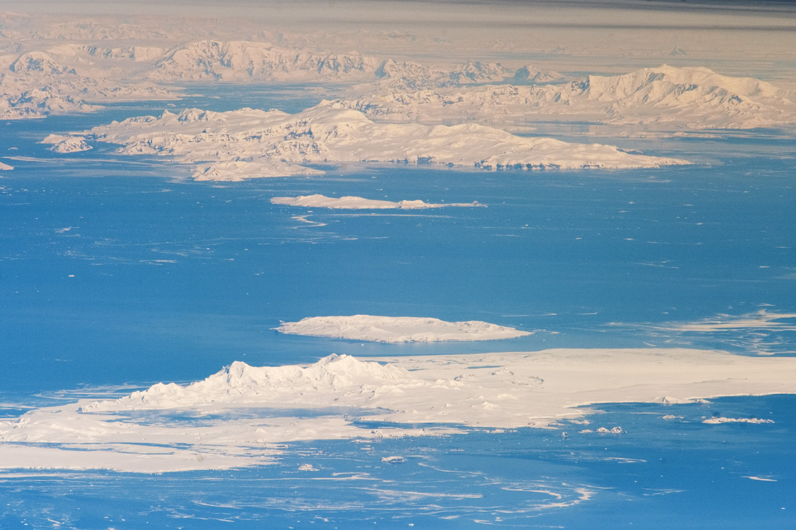
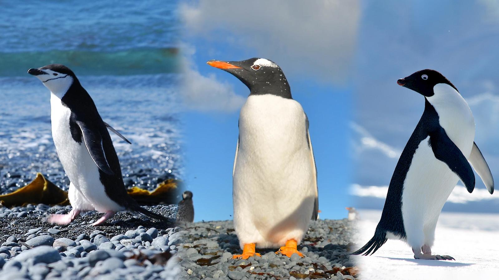

```{r}
#| include: false
library(tidyverse)
library(fable)
library(fabletools)
library(ggthemes)
set_theme(theme_clean())
suppressWarnings(set_theme(theme_clean()))
library(lubridate)
library(feasts)
library(mice)
library(naniar)
library(kableExtra)
```

# Introdução

## O cenário climático

Notícias recentes como [Planeta atinge 1º ponto crítico climático catastrófico e irreversível](https://www.cnnbrasil.com.br/tecnologia/planeta-atinge-1o-ponto-critico-climatico-catastrofico-e-irreversivel/) [@cnn2025planeta] são impactantes e evidenciam a necessidade de estudos sobre mudanças climáticas.

-   Embora seja um alerta global, os efeitos mais críticos são frequentemente observados nos polos;
-   A Península Antártica é uma das regiões de aquecimento mais rápido do planeta;
-   O Arquipélago de Palmer atua como um "laboratório natural" para estudar as consequências ecológicas.

Arquipélago de Palmer abriga três espécies de Pinguins do gênero *Pygoscelis*: Gentoo (*Pygoscelis papua*), Adelie (*Pygoscelis adeliae*) e Chinstrap (*Pygoscelis antarcticus*).



## Objetivo de estudo

O impacto das mudanças climáticas sobre as populações de pinguins não são iguais para cada espécie, devido, principalmente, às distintas afinidades ecológicas.

Neste sentido, o objetivo do trabalho é investigar a relação entre as variáveis climáticas -- temperaturas e precipitação -- e a dinâmica populacional de pinguins do gênero *Pygoscelis*. Em particular:

-   Contabilizar a porcentagem entre sexo por espécies, avaliando as relações entre sexo, tamanho do bico e comprimento do bico;
-   Contabilizar a frequência das espécies por ilha;
-   Avaliar tendências de temperatura do ar, da superfície do mar e precipitação.

# Conhecendo os pinguins

A @tbl-pin-comp resume as principais características de cada espécie, com foco em sua ecologia e vulnerabilidade às mudanças climáticas.

```{r}
#| echo: false
#| tbl-cap: "Resumo comparativo das três espécies de pinguins (Pygoscelis) do Arquipélago de Palmer. Fonte: @penguins_species; @gentoo_secret_atlas; @adelie_natgeo; @chinstrap_marinebio."
#| label: tbl-pin-comp
tibble::tribble(
  ~Característica, ~Gentoo, ~Adelie, ~Chinstrap,
  "Porte Físico", "Grande (5-8 kg)", "Médio (3-6 kg)", "Médio (3-6 kg)",
  "Marcas Distintivas", "Faixa branca no topo da cabeça e bico vermelho-alaranjado vibrante", "Anel branco distintivo ao redor dos olhos", 'Fina faixa preta sob o queixo, "barbicha"',
  "Distribuição", "A mais ampla e adaptável das três, habitando desde costas rochosas a ilhas com gelo", "Estritamente Antártico, nidificando no continente e ilhas adjacentes", "Habita ilhas e costas no Pacífico Sul e no setor Antártico", 
  "Ecologia", 'Prefere águas abertas para forrageamento. Sua adaptabilidade e menor dependência do gelo o tornam um potencial "vencedor", expandindo seu território para o sul à medida que o gelo recua.', "Fortemente dependente do gelo marinho para descanso e acesso a áreas de alimentação (krill). Sua população é altamente vulnerável ao recuo do gelo.", "Fortemente dependente do gelo marinho para descanso e acesso a áreas de alimentação (krill). Sua população é altamente vulnerável ao recuo do gelo."
) %>% 
  kable(
    align = "l"
  ) %>% 
  column_spec(1, width = "8em") %>%
  column_spec(2, width = "9em") %>% 
  column_spec(3, width = "9em") %>% 
  column_spec(4, width = "9em")
```

::: {layout="[[40, 60], [100]]" layout-valign="center"}



:::

# Conjunto de dados

Para explorar a relação entre o clima e a ecologia dos pinguins, dois conjuntos de dados principais serão utilizados.

## Dados Meteorológicos

O contexto ambiental é fornecido pelos dados diários da estação meteorológica de Palmer [@lterweather2024]. Entre as variáveis disponíveis (ver @tbl-weather), as variáveis de temperatura serão o foco principal do estudo.

## Dados Biológicos

O conjunto de dados sobre os pinguins do arquipélago de Palmer está livremente disponíveis e pode ser acessado facilmente através do pacote `palmerpenguins` no R [@R2025]. que disponibiliza os dados originalmente publicados por @gorman2014. Há dois datasets contidos nessa biblioteca: `penguins` (versão limpa) e `penguins_raw` (dados bruta).

A descrição completa dos dados brutos está presente na @tbl-penguins. Entre as variáveis disponíveis, serão utilizadas `Species`, `Island`, `Culmen Length`, `Culmen Depth`, `Body Mass`, `Sex`. Também espera-se utilizar as variáveis `Delta 15 N` e `Delta 13 C`, pois os isótopos estáveis são indicadores da dieta a nível trófico dos pinguins.

```{r}
#| echo: false
#| tbl-cap: "Descrição das variáveis do conjunto de dados `penguins_raw`."
#| label: tbl-penguins
tibble::tribble(
  ~Variável, ~Tipo, ~Descrição,
  "studyName", "Texto", "Identificação do estudo/expedição",
  "Sample Number", "Numérica", "Número da amostra",
  "Species", "Fator", "Espécie do pinguim",
  "Region", "Fator", "Região da coleta",
  "Island", "Factor", "Ilha onde o pinguim foi registrado",
  "Stage", "Fator", "Estágio do ciclo reprodutivo",
  "Individual ID", "Texto", "Identificador individual do pinguim",
  "Clutch Completion", "Fator", "Se os ovos completaram o ciclo (Yes/No)",
  "Date Egg", "Data", "Data da postura do ovo",
  "Culmen Length (mm)", "Numérica", "Comprimento do bico (mm)",
  "Culmen Depth (mm)", "Numérica",  "Profundidade do bico (mm)",
  "Flipper Length (mm)", "Numérica", "Comprimento da nadadeira (mm)",
  "Body Mass (g)", "Numérica",   "Massa corporal (g)",
  "Sex", "Fator", "Sexo do pinguim (Male/Female)",
  "Delta 15 N (o/oo)", "Numérica", "Isótopo $\\delta {}^{15}$N (‰)",
  "Delta 13 C (o/oo)", "Numérica", "Isótopo $\\delta {}^{13}$C (‰)",
  "Comments", "Texto", "Comentários adicionais do pesquisador"
) %>% 
  kable(
    align = "lll",
    escape = FALSE
  )
```

```{r}
#| echo: false
#| tbl-cap: "Descrição das variáveis do conjunto de dados meteorológico na estação de Palmer."
#| label: tbl-weather

tibble::tribble(
  ~Variável,                      ~Tipo,        ~Descrição,
  "Date",                         "Data",       "Dia da medição meteorológica",
  "Temperature.High..C.",         "Numérica",   "Temperatura máxima diária (°C)",
  "Temperature.Low..C.",          "Numérica",   "Temperatura mínima diária (°C)",
  "Temperature.Average..C.",      "Numérica",   "Temperatura média diária (°C)",
  "Sea.Surface.Temperature..C.",  "Numérica",   "Temperatura da superfície do mar (°C)",
  "Sea.Ice..WMO.Code.",           "Fator",      "Código WMO de condição de gelo no mar",
  "Pressure.High..mbar.",         "Numérica",   "Pressão atmosférica máxima (mbar)",
  "Pressure.Low..mbar.",          "Numérica",   "Pressão atmosférica mínima (mbar)",
  "Pressure.Average..mbar.",      "Numérica",   "Pressão atmosférica média (mbar)",
  "Wind.Peak..knots.",            "Numérica",   "Velocidade máxima do vento (nós)",
  "Wind.5.Sec.Peak..knots.",      "Numérica",   "Pico do vento em intervalo de 5s (nós)",
  "Wind.2.Min.Peak..knots.",      "Numérica",   "Pico do vento em intervalo de 2min (nós)",
  "Wind.Average..knots.",         "Numérica",   "Velocidade média do vento (nós)",
  "Wind.Peak.Direction",          "Numérica",   "Direção (graus) do pico de vento",
  "Wind.5.Sec.Peak.Direction",    "Numérica",   "Direção do vento em pico de 5s",
  "Wind.2.Min.Peak.Direction",    "Numérica",   "Direção do vento em pico de 2min",
  "Wind.Prevailing.Direction",    "Fator",      "Direção predominante do vento",
  "Precipitation.Melted..mm.",    "Numérica",   "Precipitação derretida (mm)",
  "Precipitation.Snow..cm.",      "Numérica",   "Precipitação de neve (cm)",
  "Depth.at.Snowstake..cm.",      "Numérica",   "Profundidade da neve medida (cm)",
  "Sky.Coverage..tenths.",        "Numérica",   "Cobertura do céu ($10^{-1}$)"
) %>% 
  kable(
    escape = F,
    align = "l"
  )
```

# Análise Exploratória dos Dados

1.  Validação da Amostra: Equilíbrio Sexual
2.  Contexto Amostral: Distribuição Geográfica
3.  Biometria: Massa Corporal e Dimorfismo
4.  Evidência de Nicho Ecológico: Morfologia do Bico
5.  Síntese: Evidência de Nicho Trófico

```{r}
#| include: false
load("Data/tabela_biometria_resumo.RData")
load("Data/tabela_dimorfismo.RData")
load("Data/tabela_especie_ilha.RData")
load("Data/tabela_resumo_consolidade.RData")
load("Data/tabela_resumo_por_especie.RData")
load("Data/tabela_sexo_especie.RData")
load("Data/tabela_massa_sexo_estendida.RData")
load("Data/tabela_massa_morfologia_especie_sexo.RData")
load("Data/tabela_dimorfismo_final.RData")

load("Data/plot_culmen_bivariado.RData")
load("Data/plot_delta_13c.RData")
load("Data/plot_delta_15n.RData")
load("Data/plot_distribuicao_ilha.RData")
load("Data/plot_mass.RData")
```

## Validação da Amostra: Equilíbrio Sexual

```{r}
#| eval: false    #   (Não executa)
#| include: false #   (Não mostra nada)
#| echo: false
#| tbl-cap: "Estatísticas Descritivas Consolidadas das Variáveis Biométricas, Morfológicas e Tróficas."
#| label: tbl-res-cons
tabela_resumo_consolidada %>% 
  kable(digits = 2)
```

```{r}
#| echo: false
#| tbl-cap: "Contagem e Percentual de Sexo por Espécie."
#| label: tbl-count-sex-vf
tabela_sexo_especie %>% 
  kable(digits = 2)
```

## Contexto Amostral: Distribuição Geográfica

```{r}
#| echo: false
#| tbl-cap: "Distribuição de Frequência das Espécies de Pinguins por Ilha."
#| label: tbl-freq-ilha
tabela_especie_ilha %>% 
  kable(digits = 2,
        col.names = c("Espécie", "Ilha", "Contagem", "Percentual")
        
        )
```

-   **Gentoo** domina a amostra (36%), concentrado em Biscoe;
-   **Adelie** é a espécie mais dispersa.

```{r}
#| echo: false
#| fig-cap: "Distribuição da Amostra de Pinguins por Ilha e Espécie: Contexto Espacial e Amostral no Arquipélago de Palmer."
#| label: fig-freq-ilha
plot_distribuicao_ilha
```

## Biometria: Massa Corporal e Dimorfismo

```{r}
#| echo: false
#| tbl-cap: "Estatísticas Descritivas Completas da Massa Corporal por Espécie e Sexo."
#| label: tbl-massa-sexo
tabela_massa_sexo_estendida %>% 
  knitr::kable(
    digits = 2,
    col.names = c("Espécie", "Sexo", "N", "Média (g)", "Desvio (g)", 
                  "Mínimo (g)", "Mediana (g)", "Máximo (g)")
  )
```

-   Em todas as espécies, os machos são mais pesados que as fêmeas;
-   O **Gentoo Macho** é notavelmente maior ($\approx 5.5$kg) que qualquer outro grupo, reforçando sua posição de "vencedor" em porte físico;
-   O **mínimo** do Gentoo Macho (4750g) tem um valor próximo **máximo** do Adelie Macho (4775g), indicando que quase nenhuma sobreposição de tamanho.

```{r}
#| echo: false
#| fig-cap: "Massa Corporal por Espécie e Dimorfismo Sexual."
#| label: fig-count-sex

plot_mass
```

## Evidência de Nicho Ecológico: Morfologia do Bico


```{r}
#| echo: false
#| tbl-cap: "Médias de Massa e Morfológicas por Espécie e Sexo."
#| label: tbl-morfologia-especie-vf
tabela_massa_morfologia_especie_sexo %>% 
  kable(digits = 2)
```

Os dados confirmam que as diferenças não apenas em relação ao peso, mas estruturais (tamanho e forma do bico), sugerindo adaptações diferentes para forrageamento.

```{r}
#| echo: false
#| fig-cap: "Relação Comprimento vs. Profundidade do Bico."
#| label: fig-biometrica-especie

plot_culmen_bivariado
```

## Síntese: Evidência de Nicho Trófico

```{r}
#| echo: false
#| tbl-cap: "Comparação de Médias Biométricas e Tróficas por Espécie e Sexo"
#| label: tbl-biometrica-espsex

tabela_dimorfismo_final %>% 
  kable(digits = 2)
```

As diferenças em isótopos ($\delta{}^{15}$N e $\delta{}^{13}$C) confirmam que as espécies ocupam níveis tróficos e fontes de carbono distintas, validando a hipótese de que a resposta ao clima será diferenciada.

```{r}
#| echo: false
#| fig-cap: "Boxplot da Segregação Espacial e Estratificação alimentar"
#| fig-subcap: 
#|   - "Fonte de Carbono ($\\delta{}^{15}$C)."
#|   - "Nível Trófico  ($\\delta{}^{13}$N)." 
#| label: fig-biometrica-espsex
#| layout-ncol: 2

plot_delta_13c
plot_delta_15n

```

## Temperatura Média do Ar

```{r}
#| include: false

df <- read.csv("Data/PalmerStation_Daily_Weather.csv", sep = ",", header = T) %>%
  as_tibble()
```

Através da @tbl-yearNA verifica-se que há anos com datas incompletas e, também, com valores ausentes.

```{r}
#| echo: false
#| tbl-cap: "Anos completos ou com NAs."
#| label: tbl-yearNA
df %>% 
  mutate(year = year(Date)) %>% 
  group_by(year) %>% 
  summarise(
    total_dias_ano = n(),                             
    dias_com_NA = sum(is.na(Temperature.Average..C.))
  ) %>% 
  filter(year >= 1997 & year <= 2023) %>% 
  kable(
    col.names = c("Ano", "Total Dias", "Dias com NA"),
    align = "ccc"
  )
```

- Em 2009, dos 365 dias, há apenas 334 no conjunto de dados, mas todos com observações. Portanto, há valores ausentes no quesito de dias.
- Em 2006, há 365 dias no conjunto de dados, no entanto, há 8 dias com ausência de informação sobre a Temperatura média.

### Imputando os dados ausentes

A imputação dos NAs será realizada através do pacote `mice` [@mice] com a opção `pmm`. Em termos didáticos, o processo funciona em três etapas:

1. O algoritmo estima um valor provável para o dado faltante (ex: 3ºC) baseando-se nas correlações com as outras variáveis presentes (como dia do ano e temperatura do ar)
2. Ele busca no banco de dados observações reais (doadores) que tenham características estatísticas muito próximas a essa estimativa;
3. Ele seleciona aleatoriamente um desses doadores e copia o valor real observado para preencher a lacuna.

```{r}
#| include: false
palmerweather <- df %>% 
  select(
    Date, Temperature.Average..C., Temperature.High..C., Temperature.Low..C.
  ) %>% 
  mutate(
    Date = ymd(Date),
    day = yday(Date)
  ) %>% 
  filter(
    year(Date) >= 1997 & year(Date) <= 2023
  ) %>% 
  rename(
    Temp_avg = Temperature.Average..C.,
    Temp_min = Temperature.Low..C.,
    Temp_max = Temperature.High..C.
  ) %>% 
  as_tsibble(index = Date)
```


```{r}
#| output: false
dados_imputar <- palmerweather %>% 
  tsibble::fill_gaps() %>% 
  ungroup() %>% 
  as.data.frame() %>% 
  select(-Date)

imp <- dados_imputar %>% 
  mice(method = "pmm", seed = 123)

dados_imputar <- complete(imp)
```

É possível verificar se a imputação foi bem sucedida por meio da função `md.pattern()`. A @fig-pattern exibe os padrões dos valores ausente, se existir.

```{r}
#| fig-cap: "Gráfico de padrões dos valores ausentes."
#| label: fig-pattern
md.pattern(dados_imputar)
```


```{r}
#| include: false
palmerweather_imp <- palmerweather %>% 
  tsibble::fill_gaps() %>% 
  mutate(
    Temp_avg = dados_imputar$Temp_avg,
    Temp_min = dados_imputar$Temp_min,
    Temp_max = dados_imputar$Temp_max
  )
```

### Medidas resumo

A @tbl-summary-temp exibe as medidas descritivas para a Temperatura Média do Ar após a imputação dos dados ausentes.

```{r}
#| echo: false
#| tbl-cap: "Medidas descritivas para a Temperatura Média do Ar."
#| label: tbl-summary-temp
palmerweather_imp %>%
  pull(Temp_avg) %>%
  summary() %>%
  as.list() %>%
  as_tibble() %>% 
  mutate(Variável = "Temperatura Média do Ar") %>% 
  relocate(Variável, .before = Min.) %>%
  kable(
    digits = 2,
    align = "lcccccc"
  )
```


## Dados de Temperatura da Superfície do Mar e Precipitação

```{r}
#| include: false

df2 <- read.csv("Data/PalmerStation_Daily_Weather.csv", sep = ",", header = T) %>%
  as_tibble()

# Seguindo o mesmo corte realizado para os dados de temperatura:
palmerweather2 <- df2 %>% 
  mutate(
    Date = ymd(Date),
    day = yday(Date)
  ) %>% 
  filter(
    year(Date) >= 1997 & year(Date) <= 2023
  ) %>% 
  rename(
    Temp_avg = Temperature.Average..C.,
    SST_avg = Sea.Surface.Temperature..C.,
    Precip = Precipitation.Melted..mm.
  ) %>% 
  mutate(
    Precip = case_when(
      Precip == "T" ~ "0.05",
      TRUE ~ Precip
    ),
    Precip = as.numeric(Precip)
  ) %>% 
  as_tsibble(index = Date) %>% 
  tsibble::fill_gaps()
```

Um outro método para avaliarmos as variáveis com NA é através de gráficos e a função `gg_miss_var()` permite realizar essa inspeção. 

```{r}
#| fig-cap: "Gráfico de barras com número de NAs por variável. `SST_avg` representa a Temperatura Média da Superfície do Mar; `Precip`, a Preciptação e `Date` as datas diárias."
#| label: fig-miss-var
palmerweather2 %>% 
  select(SST_avg, Precip) %>% 
  gg_miss_var()+
  labs(x = "Variáveis", y="Número de NAs")+
  theme_clean()
```

Por meio da @fig-miss-var, nota-se que em ambas variáveis contém valores ausentes, com destaque para a `SST_avg` com mais de 300 NAs.

### Imputando os dados ausentes

A abordagem de imputação foi novamente por meio do `mice`, também com a opção `pmm` para ambas variáveis em abordagem, envolvendo um processo análogo que será ofuscado.

```{r}
#| include: false

dados_imputar2 <- palmerweather2 %>% 
  as_tibble() %>%
  select(day, SST_avg, Precip) %>% 
  as.data.frame()

imp2 <- dados_imputar2 %>% 
  mice(method = "pmm", seed = 123)

dados_imputar2 <- complete(imp2)

md.pattern(dados_imputar2)

palmer_full <- palmerweather2 %>% 
  mutate(
    SST_avg = dados_imputar2$SST_avg,
    Precip = dados_imputar2$Precip
  )
```

### Medidas resumo

A @tbl-summary2 exibe as medidas descritivas para as variáveis apresentadas nesta seção.

```{r}
#| echo: false
#| tbl-cap: "Medidas descritivas para Temperatura Média da Superfície do Mar e Precipitação Média."
#| label: tbl-summary2
t1 <- palmer_full %>% 
  pull(SST_avg) %>%
  summary() %>%
  as.list() %>%
  as_tibble() %>% 
  mutate(Variável = "Temperatura Média da Superfície do Mar") %>% 
  relocate(Variável, .before = Min.)

t2 <- palmer_full %>% 
  pull(Precip) %>%
  summary() %>%
  as.list() %>%
  as_tibble() %>% 
  mutate(Variável = "Precipitação") %>% 
  relocate(Variável, .before = Min.)

bind_rows(t1,t2) %>% 
  kable(
    digits = 2,
    align = "lcccccc"
  )
```

# Análise de Série Temporal

Segundo @morettin2018, uma série temporal é qualquer conjunto de observações ordenadas no tempo, podendo ser discretos ou contínuos. Exemplos práticos incluem dados meteorológicos, tais como `Temperatura` e `Precipitação`, que são coletados em intervalos regulares (diários, mensais, anuais).

Para compreender a estrutura desses dados, utiliza-se a decomposição, um procedimento estatístico que desagrega a série em três componentes fundamentais:

- **Tendência**: representa a direção de longo prazo;
- **Sazonalidade**: corresponde às flutuações periódicas;
- **Resíduos**: abrange as irregularidades aleatórias, isto é, o que não foi capturado pelas outras componentes.

Dentre as técnicas disponíveis, destaca-se a decomposição STL (*Seasonal and Trend decomposition using Loess*) pela sua robustez e flexibilidade.

## Decomposição STL das séries temporais

```{r}
#| echo: false

# Temperatura do Ar
stl_dec <- palmerweather_imp %>% 
  model(
    STL(Temp_avg~trend()+season(period = 365.25),
        robust = T)
  ) %>% 
  components()

## Sea Surface Temperature
stl_sst <- palmer_full %>% 
  model(
    STL(SST_avg~trend()+season(period = 365.25),
        robust = T)
  ) %>% components()

## Preciptação 
stl_precip <- palmer_full %>% 
  model(
    STL(Precip)
  ) %>% components() 
```

```{r}
#| echo: false
#| fig-cap: "Decomposição STL da Temperatura Média do Ar."
#| label: fig-stl-temp
stl_dec %>% 
  autoplot()+
  theme(
    plot.title = element_blank(),
    plot.subtitle = element_blank()
  )
```

```{r}
#| echo: false
#| fig-cap: "Decomposição STL da Temperatura Média do da Superfície do Mar."
#| label: fig-stl-sst
stl_sst %>% 
  autoplot()+
  theme(
    plot.title = element_blank(),
    plot.subtitle = element_blank()
  )
```

```{r}
#| echo: false
#| fig-cap: "Decomposição STL da Preciptação."
#| label: fig-stl-precip
stl_precip %>% 
  autoplot()+
  theme(
    plot.title = element_blank(),
    plot.subtitle = element_blank()
  )
```

## Analisando tendências

Uma metodologia clássica na literatura para analisar tendências em séries temporais de forma robusta é o estimador de inclinação de Sen [@sen1968].

A grande vantagem neste método é a sua capacidade de lidar lidar com valores discrepantes, que distorcem uma análise de tendência comum. O teste de hipóteses realizado consiste em testar:

$$\begin{cases}
  H_0\colon \text{A tendência é nula} \\
  H_1\colon \text{A tendência é não nula}
\end{cases}$$

Os resultados acerca desse teste estão exibidos na @tbl-sens.
```{r}
#| echo: false
#| tbl-cap: "Teste de Sen e suas estimativas pontuais e intervalares 95\\% para tendência."
#| label: tbl-sens

slope1 <- trend::sens.slope(stl_dec$trend)
slope2 <- trend::sens.slope(stl_sst$trend)
slope3 <- trend::sens.slope(stl_precip$trend)

bind_rows(
  slope1 %>% tidy(),
  slope2 %>% tidy(),
  slope3 %>% tidy(),
) %>% 
  as_tibble() %>% 
  mutate(
    var = c("Temperatura Média do Ar", "Temperatura do Mar", "Precipitação"),
    est = c(slope1$estimates, slope2$estimates,
            slope3$estimates)
  ) %>% 
  relocate(var, .before = statistic) %>% 
  relocate(est, .after = var) %>% 
  select(var, est, p.value, conf.low, conf.high) %>% 
  kable(
    col.names = c("Variável", "Estimativa", "Valor-p", "IC Lower", "IC Upper"),
    align = "lcccc"
  )
```
Uma vez que todos os valores-$p$ foram iguais a zero e, portanto, menor que $\alpha = 0.05$ de significância, rejeita-se $H_0$. Portanto, a tendência em todas as séries temporais são estatisticamente significantes.

## Visualizando a tendência

A @fig-sens permite visualizarmos com clareza a tendência a cerca das séries temporais sobre as variáveis em estudo.

```{r}
#| echo: false
#| fig-cap: "A reta ajustada para exibir a tendência nas séries temporais."
#| fig-subcap: 
#|   - "Temperatura Média do Ar"
#|   - "Temperatura do Mar"
#|   - "Precipitação"
#| layout-nrow: 3
#| label: fig-sens

stl_dec %>% 
  select(Date, trend) %>% 
  ggplot(aes(x = Date, y = trend))+
  geom_line()+
  geom_smooth(formula = y~x, method = lm)+
  labs(x = "Data", y = "Tendência")
stl_sst %>% 
  select(Date, trend) %>% 
  ggplot(aes(x = Date, y = trend))+
  geom_line()+
  geom_smooth(formula = y~x, method = lm)+
  labs(x = "Data", y = "Tendência")
stl_precip %>% 
  select(Date, trend) %>% 
  ggplot(aes(x = Date, y = trend))+
  geom_line()+
  geom_smooth(formula = y~x, method = lm)+
  labs(x = "Data", y = "Tendência")
```

## Conclusões

Como evidenciado, há uma tendência significativa de aumento para a Temperatura Média do Ar, Temperatura da Superfície do Mar e Precipitação. Com isso:

- O aquecimento do ar e do mar induz a retração das plataformas de gelo. Isso reduz o habitat das espécies dependentes de gelo (Adélie e Chinstrap), enquanto favorece a expansão de espécies generalistas que evitam gelo denso (Gentoo).
- O aumento da precipitação eleva o risco de mortalidade de filhotes por hipotermia, visto que a penugem molhada perde o isolamento térmico e prejudica a nidificação pelo acúmulo de lama.
- Neste cenário, consolida-se a dinâmica de "Vencedores" e "Perdedores", com o Gentoo tende a prevalecer populacionalmente sobre as espécies especialistas.


# Agradecimentos


<!-- # TODO -->

<!-- 1. Pesquisar relações para efetuar a metodologia -->

<!-- 2. quantidade de pinguins por ano; -->

<!-- 3. Investigar relação entre peso em funcao do comprimento e tamanho do bico -->

<!-- 4. Buscar geolocalizações das ilhas para fazer graficos de mapa -->
